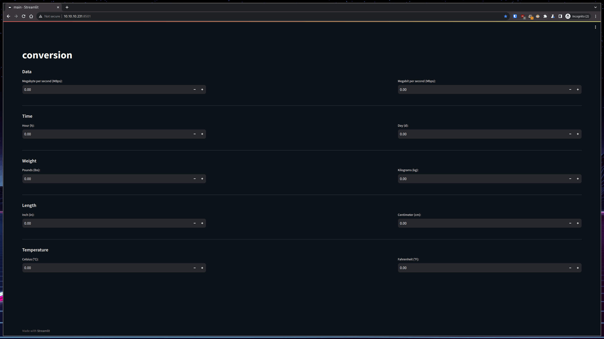

# Conversion

## About Conversion

There are many great conversion app on GitHub; however, I didn't find one that really suited my needs so I created this enhanced one. I would like to convert my fiber internet up and down connection speed from MBps which I get from [Ookla](https://www.speedtest.net/) to Mbps. Additionally, I would like to change the weight, height and reach of [UFC athletes'](https://www.ufc.com/athletes) from pounds/lbs to kilograms/kg and from inch/in to centimeter/cm which is problematic due to the fact that I live in Ethiopia, not the United States, and our measurements differ.

## Built With

+ python
+ streamlit

## Getting Started

To get a local copy up and running follow these steps.

### Prerequisites

+ Debian machine
+ python3, pip3, virtualenv
```shell
sudo apt install -y python3 python3-pip virtualenv
```
+ docker and portaineir *(optional)*
```shell
sudo apt install -y ca-certificates curl gnupg2 apt-transport-https software-properties-common && curl -fsSL https://download.docker.com/linux/debian/gpg | sudo gpg --dearmor -o /usr/share/keyrings/docker-archive-keyring.gpg && echo "deb [arch=amd64 signed-by=/usr/share/keyrings/docker-archive-keyring.gpg] https://download.docker.com/linux/debian $(lsb_release -cs) stable" | sudo tee /etc/apt/sources.list.d/docker.list && sudo apt update && sudo apt install -y docker-ce docker-ce-cli containerd.io docker-buildx-plugin docker-compose-plugin && sudo usermod -aG docker $USER && newgrp docker && sudo service docker enable && sudo service containerd enable && cd && docker volume create portainer_data && docker run -d -p 8000:8000 -p 9443:9443 --name portainer --restart=always -v /var/run/docker.sock:/var/run/docker.sock -v portainer_data:/data portainer/portainer-ce:latest
```

### Installation

This template doesn't rely on any external dependencies or services.
1. clone the repo
```shell
https://github.com/kidistbedilu/conversion.git && cd conversion
```
2. create and activate virtual environment
```shell
virtualenv env && source env/bin/activate
```
3. install python modules or packages
```shell
pip install -r requirements.txt 
```

### Usage

1. run conversion app
```shell
streamlit run main.py
```
2. open the streamlit app at port `8501` 

Conversion app with light and dark mode gif.



[conversion app demo]() powered by  

## Roadmap

- [x] streamlit app
- [ ] RESTful API with FastAPI
- [ ] Telegram-Bot Telegram Bot with Telebot
- [ ] Dockerize  
    - [ ] Publish Docker image to GitHub container registry
- [ ] Multi-language Support
    - [x] English
    - [ ] Amharic
    - [ ] Oromo
    - [ ] Tigrinya

> See the [open issues](https://github.com/kidistbedilu/conversion/issues) for a full list of proposed features and known issues.

## Contributing

Any contributions you make are greatly appreciated. If you have a suggestion that would make this better, please fork the repo and create a pull request. Don't forget to give the project a star! Thanks again!!!

1. fork the project
2. create your feature branch `git checkout -b feature/amazing-feature`
3. commit your changes `git commit -m 'feat: add amazing feature'` use the [conventional-commit](https://www.conventionalcommits.org/en/v1.0.0/) specification
4. push to the branch `git push origin feature/amazing-feature`
5. open a pull request

## Contact

Kidist Bedilu | [kidistbedilu.com](kidistbedilu.com) | [me@kidistbedilu.com](me@kidistbedilu.com) | [@kidistbedilu](@kidistbedilu)

## License

Distributed under the [MIT License](https://opensource.org/license/mit/).
